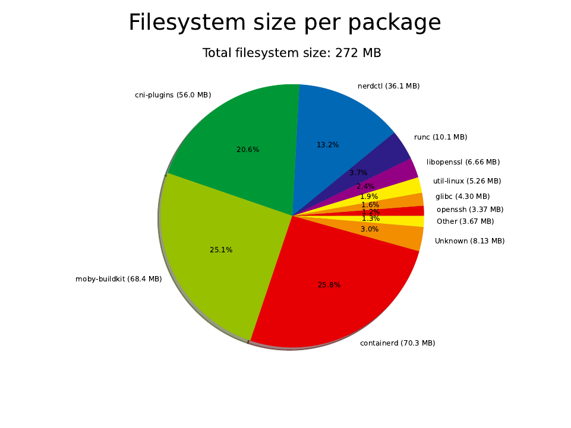

# microvm-buildroot

Some files for making a custom `vmlinux` and `rootfs.ext4` with buildroot.

For now it is just using the default kernel config and standard packages.

For this setup, we also want to run `sshd` and we want to run `containerd`.

TODO: Change the QEMU example, from standard machine to" microvm" (no PCI).



## firecracker

```shell
sudo firectl --kernel=output/images/vmlinux \
             --root-drive=output/images/rootfs.ext4 \
             --kernel-opts="ro console=ttyS0 reboot=k panic=1 pci=off nomodules"
```

Note: we need to remove the `noapic` parameter, is only valid for the AWS kernel

`[    0.000000] Linux version 6.12.33 ...`

`[    0.735274] VFS: Mounted root (ext4 filesystem) ...`

`[    0.769825] Run /sbin/init as init process`

## qemu-system

```shell
qemu-system-x86_64 -kernel output/images/vmlinux \
                   -drive file=output/images/rootfs.ext4,if=virtio,format=raw \
                   -append "rootwait root=/dev/vda console=tty1 console=ttyS0" \
                   -device virtio-rng \
                   -serial stdio -display none -audiodev none,id=none \
                   -device virtio-mouse -device virtio-keyboard \
                   -machine q35 -m 512M -accel kvm -cpu host
```

Note: use virtio for file/network and random, replace PS/2 emulation with virtio

`[    0.000000] Linux version 6.12.33 ...`

`[    0.843564] VFS: Mounted root (ext4 filesystem) ...`

`[    0.865686] Run /sbin/init as init process`
